## Overview ##

Choose Your Own Adventure is a powerful widget that allows for the creation of branching decision trees. Students are scored based on where they end up.

While building your Adventure widget, keep in mind: with great power comes great responsibility. Adventure allows you to create decision trees that are as simple or as complicated as you like. Keep the user's experience in mind while building the various pathways they may take through your widget.

Each point on the tree, known as a *destination* or *node*, represents a screen and possible interaction.

1. Title of the widget
2. A blank destination
3. Zoom controls
4. Inventory items

## Details ##

### Creating a New Destination ###

Click a blank destination and select **"Edit"** to choose a destination type.

### Destination Types ###

Each destination can be one of five different types:

1. **Multiple Choice:** Given a question, students select one of several possible answers.
2. **Short Answer:** Given a question, students input a word or phrase. This input will be matched against pre-determined responses you provide.
3. **Hotspot:** Students are provided with an image and optional label. They can then select one of several highlighted parts of the image.
4. **Narrative:** Students are provided some expository, explanatory, or narrative text, and then continue to the next Destination.
5. **End Point:** This destination provides a conclusion to the widget if the student ends up there. A score is provided and the student is sent to the score screen.

<aside>
	Note that End Points are omitted from the destination selection screen for the Start destination.
</aside>

Each destination type is identified by an icon. An example tree is shown below:

1. Narrative
2. Multiple Choice
3. Short Answer
4. Hotspot
5. Ending
6. Blank (New) Destination

### Creating a Multiple Choice Destination ###

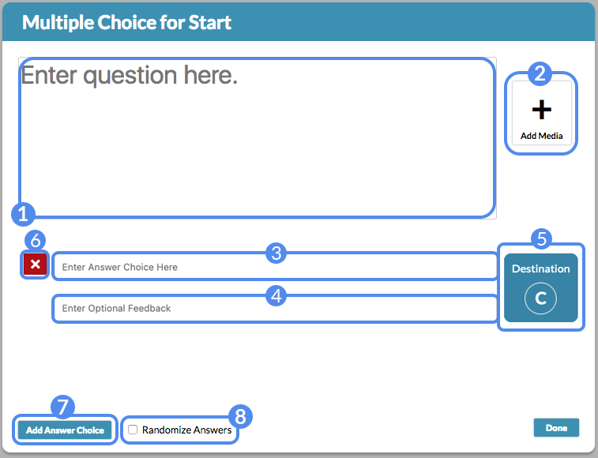

1. Question text field
2. Add an image to accompany the question
3. Answer text field
4. Optional feedback to accompany this answer
5. The destination this answer will point to
6. Delete this answer
7. Add an additional answer
8. Randomize the answer order

### Creating a Short Answer Destination ###

The Short Answer screen is very similar to the Multiple Choice screen, with the exception of how it handles answers. Users enter a response based on the question text or image.

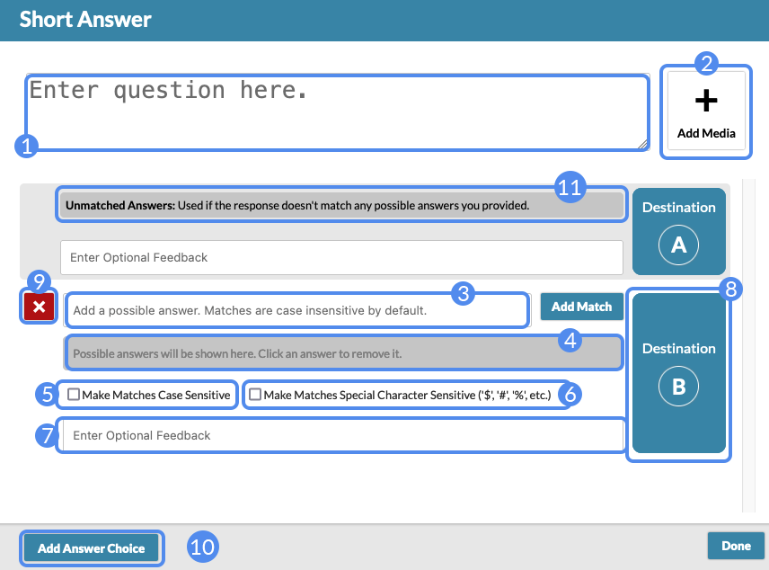

1. Question text field
2. Add an image to accompany the question
3. Add a new word or phrase to match
4. Set of words or phrases that can be matched for this answer
5. Option to make matches case sensitive (e.g. "match" will be treated differently than "MATCH")
6. Option to make matches special character sensitive (e.g. "$5" will be treated differently than "5")
7. Optional feedback to accompany this set of answers
8. The destination this answer set will point to
9. Delete this answer set
10. Add an additional answer set
11. The catch-all answer set if a user's response does not match any provided answers

<aside>
	The widget will attempt to match the user's response to all possible answers provided across all answer sets. If no match is made, the <em>Unmatched Answers</em> choice is selected.
</aside>

### Adding Short Answers ###

In the "Add possible answer" input box, you can enter a word or phrase to be matched against what the user will enter in the Short Answer input box when playing the widget. Type Enter or select "Add Match" to add it to the answer set. To remove a possible answer from the answer set, simply click on it.

1. Add a new possible answer
2. Set of additional possible answers

<aside>
	If the user response matches any of these possible answers, the user will be sent to the destination associated with this set.
</aside>

**Note:** Single words or simple phrases are best for Short Answer responses. While the matches are not case sensitive, spaces and punctuation count.

### Creating a Hotspot Destination ###

The Hotspot creation screen provides tools to highlight and label parts of an image. Depending on the hotspot the user selects, they will be taken to a specified destination.

1. Optional instructions associated with the hotspot image
2. The hotspot image
3. Hotspot creation tools (rectangle, ellipse, or polygon)
4. Hotspot visibility settings
5. Change the hotspot image
6. Example elliptical hotspot
7. Example rectangular hotspot
8. Example polygon hotspot

<aside>
	Elliptical and rectangular hotspots have a drag handle on the lower-right; you can use it to resize the hotspot once placed.
</aside>

### Drawing a Polygon Hotspot ###

To draw a polygon, select the **+Polygon Hotspot** button. Click anywhere on the image to begin drawing the polygon. Once the first point is placed, each additional click on the image will add a new side to the polygon. Once you've drawn the polygon to your satisfaction, click near the very first point to "close" the polygon and create the hotspot.

### Hotspots ###

Once a hotspot is drawn on the image, selecting it brings up the hotspot dialog. To relocate the hotspot, click and drag it.

1. The optional mouse-over label to accompany this hotspot
2. Optional feedback to associate with this hotspot
3. Color selection: clicking this will open a small drawer to select the color you'd like the hotspot to be.
4. Change the vertical arrangement of the hotspot (relative to other hotspots that overlap)
5. The destination this hotspot will point to

### Hotspot Visibility ###

Selecting "Edit Visibility" lets you change the default visibility of hotspots. The options are:

1. Always show hotspots (this is the default)
2. Reveal hotspots on mouseover
3. Don't show hotspots (the cursor will still change to indictate a part of the image can be selected)

### Creating a Narrative Destination ###

Narrative screens do not have any sort of interaction, but rather provide transitional text or images between one destination and another.

1. Narrative text field
2. Add an image to accompany the narrative
3. The destination this narrative will point to

### Creating an End Destination ###

Endings are functionally identical to Narrative Destinations. Instead of selecting a destination to point to, endings provide a final score and end the widget.

1. Ending text field
2. Add an image to accompany the ending text
3. The final score associated with this ending

<aside>
	Remember that regardless of the path a user takes through your widget, every path must terminate in an end point. Take care in the design of your widget to ensure every route ends in a sensible and logical manner.
</aside>

### Adding Images or Video to Destinations ###

For any destination type besides Hotspot, selecting the **Add Media** button changes the layout of the destination to associate an image or video with the destination's text. The dialog option provides you with a choice between uploading an image or linking a **YouTube** or **Vimeo** video URL.

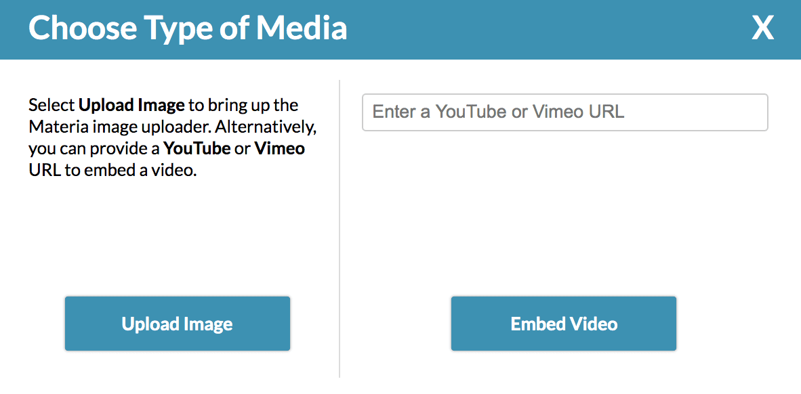

If you choose to upload an image, the image uploader will be displayed, where you can upload images from your computer, or select an image you've previously uploaded to Materia. Once you've selected an image or video, you can use the **Swap with Question** button below the media to switch the arrangement of the image and question text. Narrative and End Point destinations allow you to choose between vertical as well as horizontal arrangements. Select **Change Media** to choose a different image or video.

### (Advanced) Conditional Text Based on Number of Visits
You have the option of creating different question text each time a player visits a destination. Click on the "Advanced Question Editor" at the top right of the node creation screen to open the editor.

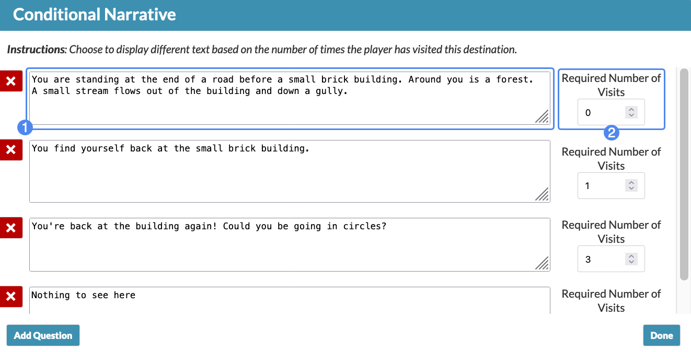

1. Add question text
2. Change required number of visits

It will always display the question text with the most required number of visits met. For example, if a player has visited the node 2 times, it will display the second question above. If a player has visited the node 6 times, it will display the third question above.

## Inventory System ##

Optionally, you can choose to use the inventory system. The inventory system allows you to give the player items or remove items from the player's inventory for each destination they visit.

Additionally, you can require the player to have certain items in their inventory to be able to select an answer option in Multiple Choice, Short Answer, or Hotspot.

### Creating Inventory Items ###

To use the inventory system, you must first create the items. Click **Add Inventory Items**.

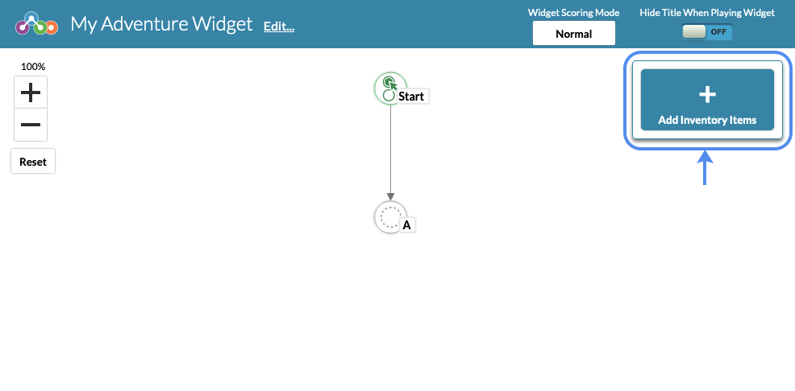

This will open the Item Editor where you can begin creating items.

1. Enter Item Name
2. Add Item
3. Save and Close the Item Editor.
4. Edit Item
5. Delete Item (This will also remove the item from all destinations it has been added to. Adding items to destinations will be explained in the next section.)

Clicking **Edit** will open the options for that specific item.

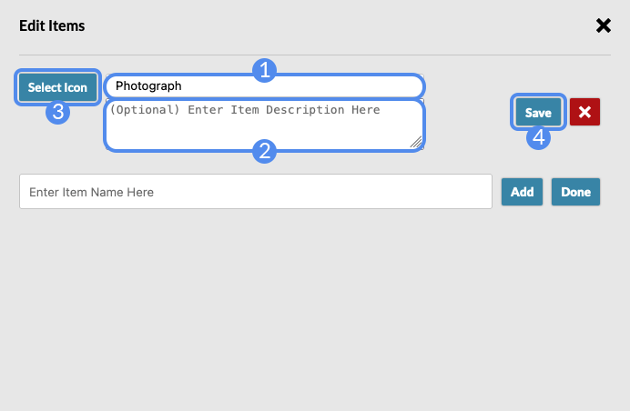

1. Edit the item name
2. (Optional) Add Item Description
3. (Optional) Open the Icon Selector
4. Save Item
5. (Advanced) Make this a silent item. The player will not see this item in their inventory nor see it listed as a required item for an answer. An instance where this could be useful is in a choices-matter scenario. You could have an answer appear (or not appear) if the player has made a certain choice in the past.
6. Delete Item

#### Icon Selector ####
To add icons to an item, click **Select Icon** to open the Icon Selector.

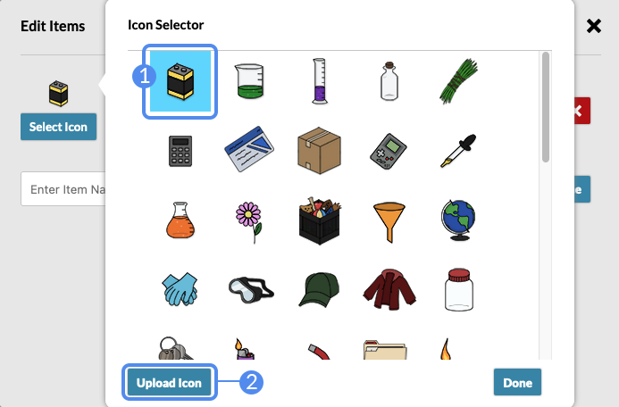

1. Click an icon to select it. Click it again to remove it.
2. To upload your own icon, select **Upload Icon** inside the icon selector. This will display the image uploader. PNG, JPG, and SVG files are all accepted. Uploaded icons will show up at the bottom of the icon selector.

Remove *custom uploaded icons* by selecting the icon in the icon selector and clicking **Remove Selected Icon**.

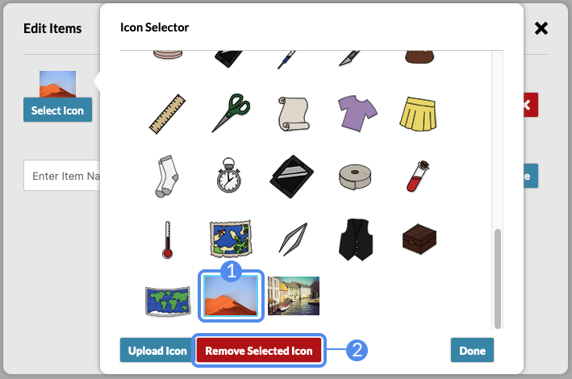

### Adding Items to Destinations ###

Once you have created the inventory items, an option to add items to destinations will appear in any destination besides End Point.

Selecting the **Add Items** button will display the item editor for individual nodes. Inside the editor, you can choose to add items to a player's inventory or remove items from a player's inventory.

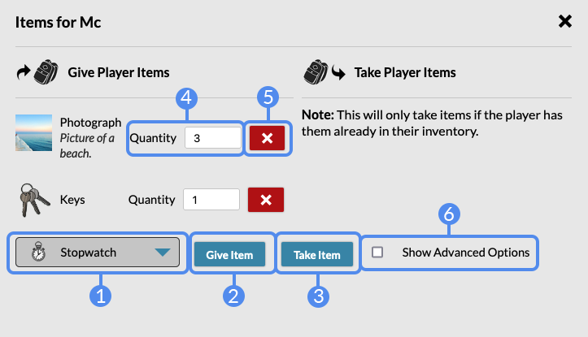

1. Select an item from the dropdown
2. Give the item to the player
3. Take the item from the player. Note, however, that you can only remove an item from a player's inventory if they already have the item (i.e. you gave the player that item in a previous destination).
4. Adjust the quantity of the item being given or taken. Only positive values greater than 0 are accepted.
5. Remove the item
6. Show Advanced Options.

#### Advanced Options for Giving Items

Selecting "Give On First Visit Only" will give the player the item only once upon their initial visit to a destination; if the player returns to this destination, they will not receive the item again.

#### Advanced Options for Taking Items

1. Take the item only upon the player's initial visit to the destination.
2. Take all of this type of item from the player.

### Adding Required Items to Answers ###

Once you have created items, an option to add required items to Multiple Choice Answers, Short Answer Match Sets, or Hotspots will appear in the respective destination types, as indicated by the lock icon (1). An additional setting appears in multiple choice and hotspot answers that allows you to hide the answer if the player does not have the required item(s), indicated by the "eye" icon (2).

#### Multiple Choice ####

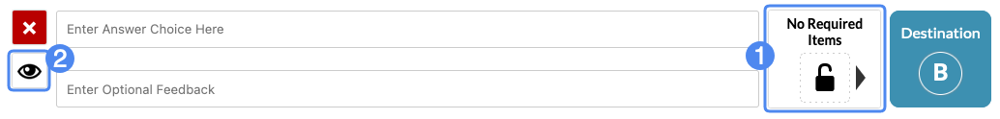
#### Hotspot ####

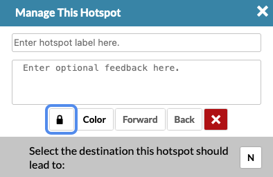

#### Short Answer ####

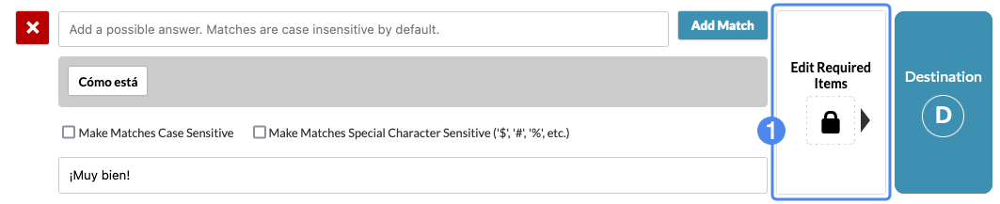

### Required Item Editor ###

Although the image below was taken inside the Hotspot, the Required Item Editor appears and functions the same for each destination node type.

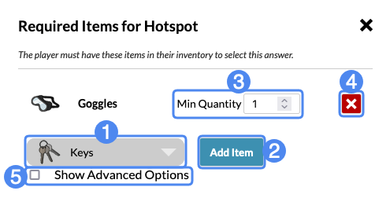

1. Select an item from the dropdown
2. Make the item required for this answer to be selected
3. Change the amount required
4. Remove the item from required items
5. Show advanced options (see below)

#### Advanced Options

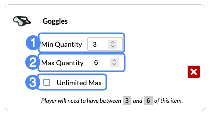

The advanced options allow you to set the required item amount to be within a specific range.

1. Set the minimum number the player can have of this item to select this answer.
2. Set the maximum number the player can have of this item to select this answer.
3. (Default) Set the maximum to have no cap.

### (Advanced) Conditional Question Text Based on Items
Once you have created items, an option will appear in the Advanced Question Editor to require items for each question text. You can require players to have certain items in their inventory in order to see different questions by clicking on the "Edit Required Items" button. This menu will operate similarly to the required items for answers from above.

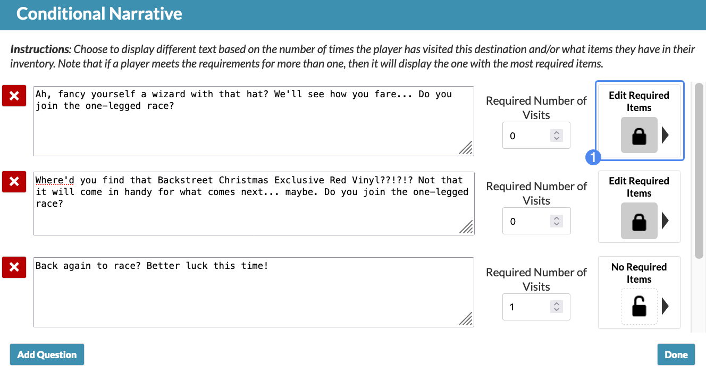

It will always display the question text with the most requirements met. For example, if the first question requires the player to have a hat, but the second question requires the player to have a hat AND a vinyl, it will display the second question if the player has both.

### Example Tree Using Inventory System ###

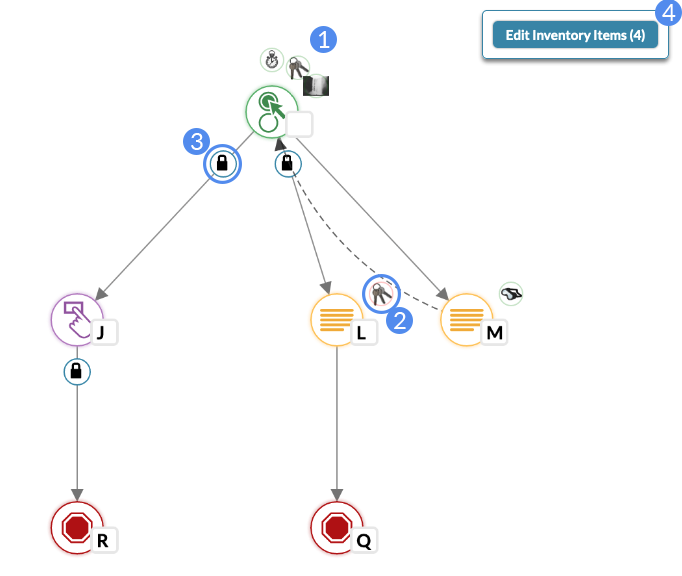

1. Destinations that give or take items will display them in a circle surrounding the node.
2. Items being taken by the destination will have a red circle around them. Items being given will have a green circle around them.
3. The lock icon indicates that the answer choice requires items in order for the player to select it. Hover over the lock to see which items are required.
4. The total number of items created will be displayed by the **Edit Inventory Items** button in parantheses.

## Action History ##

The Action History feature serves two purposes: first, it allows for immediate **undo** and **redo** options when required. Second, it allows you to traverse through previous actions and reset your work to a previous state. This way, you can easily recover from an unintended situation without having to re-create destinations or reload the widget and lose your work.

By default the Action History bar is minimized. Clicking the bar will expand the Action History window, listing all the individual actions you have performed during the current session. Note that Action History is not saved when the widget is saved; therefore, if you reload the page or revisit the creator later, it will not restore previous actions.

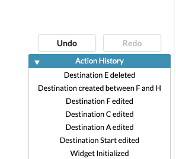

**Actions**, in this case, are defined as changes made to the decision tree: adding a new Destination, deleting a Destination, or making changes to a Destination's question or answer text, for example. Selecting an action from the list will restore the entire decision tree to the "snapshot" created just after the action was performed. In the above example, selecting "Destination created between F and H" would restore the decision tree to what it looked like once that action was performed. Destination E would still be present because the next action, "Destination E deleted", would not have occurred yet.

You can traverse the history of actions freely without losing your work. However, selecting an earlier action, and then making changes to decision tree from that point, **will delete any actions created after that action was performed.** As an example, selecting "Destination F edited", then making a change to the decision tree, would result in the deletion of the original actions created afterwards: "Destination created between F and H", and "Destination E deleted", in this example. They would be replaced by the new action performed on this "new" timeline.

## Advanced Decision Tree Design ##

### Options for Selecting a Destination ###

With the exception of End Points, every answer for every destination in your tree will point to another destination. By default, when creating a new answer, Adventure will create a new, blank destination to which that answer will point. You can change where the answer points to by selecting the answer's destination button.

1. Clicking this destination button brings up the dialog to select the destination type
2. The destination is a new, blank node (this is the default)
3. Link to an existing destination, allowing the user to travel to another point on the decision tree
4. The user will be "looped back" to this same destination

Depending on which of these three types is selected, the tree will change to indicate where the answer will point.

1. Indicates the parent's answer points to the child destination (this is the default)
2. Indicates the parent's answer points to another destination on the tree that isn't a child of the parent
3. The parent's answer loops back and points to itself

<aside>
	NOTE: Keep in mind that changing the destination of an answer may remove child destinations. For example, if your answer originally pointed to destination B, and destination B had its own answers with child destinations, changing the target destination of that answer would remove destination B and any children.
</aside>

### Adding In-Between Destinations ###

It's possible to add a new destination along a link in between two existing destinations. Simply hover your cursor over the midpoint of the link and select the "+" icon that appears.

In the example below, an in-between destination, **I**, was added between **A** and **B**:

Note that a link exists between I and B, despite B being blank. When editing destination I, upon selecting a destination type, the first answer will automatically point to destination B.

### Resetting, Converting, and Copying Destinations ###

When you select a destination, a small dialog provides a number of options in addition to simply editing it. Namely, **Reset**, **Convert**, and **Copy**.

**Resetting** a destination reverts it to a blank destination *and removes all answers, including associated child destinations.* A warning dialog will appear to inform you that the destination's sub-tree will be erased.

**Converting** a destination allows you to convert a destination to another type, with some caveats. Multiple Choice and Short Answer destinations can be converted to one another; the same with Narratives and End Points. Hotspot destinations cannot be converted.

**Copying** a destination will make a complete copy of the destination, *including all of its answers and child destinations*. In effect, the destination and its entire sub-tree are copied. Once the copy option is selected, you will be prompted to select another blank destination on the tree to be the copy target. The blank destination will be replaced by the copied destination and its sub-tree.

There are a few things to keep in mind when copying a destination:

1. Making changes to the copied sub-tree will not affect the original. If you copy destination B, and the copy becomes destination N, making changes to destination N will not affect B.
2. Answers that point to their default child destinations will point to the copied child destination, not the original, *with the exception of answers that point to an existing destination, represented by a dashed line.* These will point to their *original targets*, even if that target was copied as well. As an example, consider the tree below:

For this tree, we will make a copy of **destination A**, targeting **destination F** as the destination to be replaced.

Note that destination F has become a copy of destination A, *including destination all of destination A's child destinations.* B, C, D, F, and G have become I, K, J, L, and M, respectively. Their answers point to the respective copies of the originals, with the exception of destination B's answer that originally pointed to destination F. The copied answer for destination I will continue to point to the original target, F.

<aside>
	Copying destinations and sub-trees can have a number of uses in the design of your widget: for example, you can create two sub-trees with subtlely different details and endings by creating one version of the sub-tree, copying it, and making edits to the copied sub-tree to reflect the different consequences of that path.
</aside>

