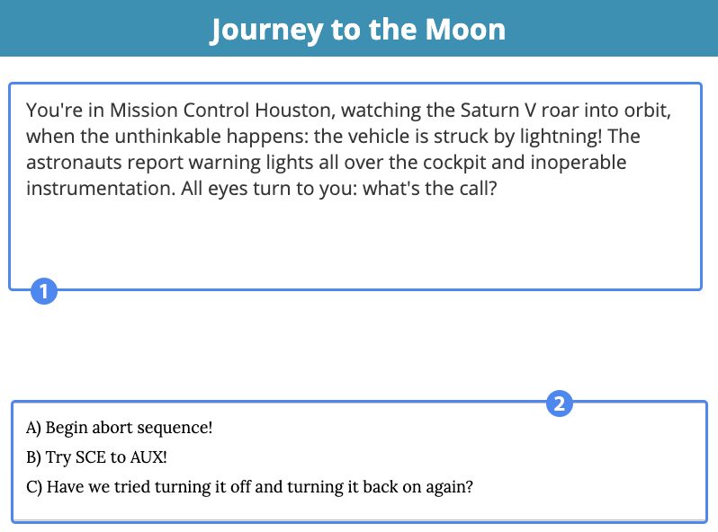
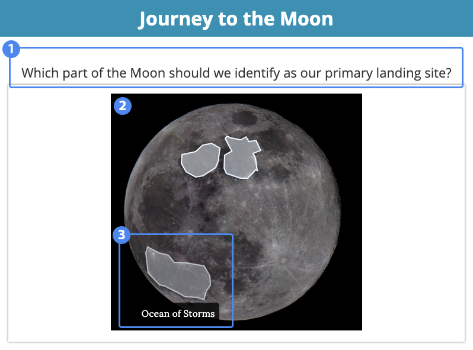
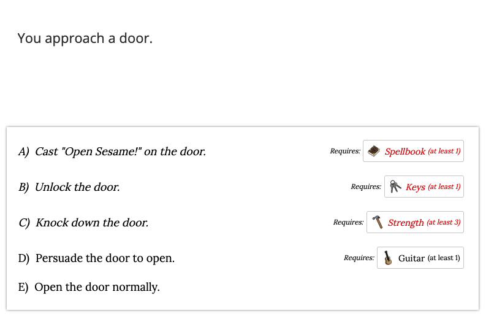

# Overview #

Choose Your Own Adventure is a powerful widget that allows for the creation of branching decision trees. Students are scored based on where they end up.

1. Narrative text or question
2. Response selection

## Details ##

Each destination, or point on the decision tree, is represented by a screen such as the one above. A question or narrative text, accompanied by an optional image, provides the context for your response. Some screens will provide multiple choice answers to choose from; others may provide an input box in which to enter a response. Other screens may not require an answer, and simply provide transitional text or information to advance the widget's narrative.

### Hotspot Screen ###

The hotspot screen is the one significant exception to the Adventure widget's layout. Hover your cursor over the image to identify and select a hotspot, based on the (optional) instructions provided. The proceeding destination may depend upon the hotspot you select.

1. Optional instructions
2. Hotspot image
3. Example hotspot

### Inventory
Some widgets may give you items as you progress. You can view your items by clicking the backpack in the top right of the screen.

Your inventory will show what items you have, the quantity of those items, and their descriptions.

Sometimes, multiple choice answers, hotspots, or even short answer responses require you to have certain items. Keep playing, and you might just end up finding these items!

### Your Choices Determine Your Score ###

In Choose Your Own Adventure, the score you receive is based on the final screen you encounter. Your responses to various questions determine the route you take; some widgets may be more linear than others. Additionally, you may or may not encounter screens of every type (Multiple Choice, Short Answer, Hotspot, and Narrative).